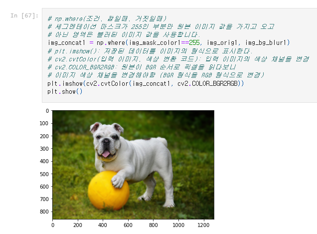
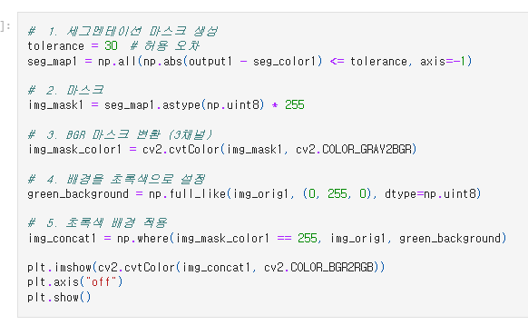
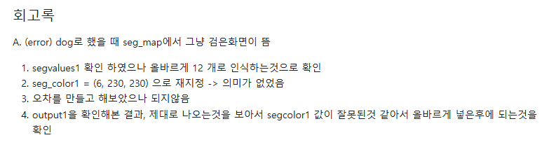
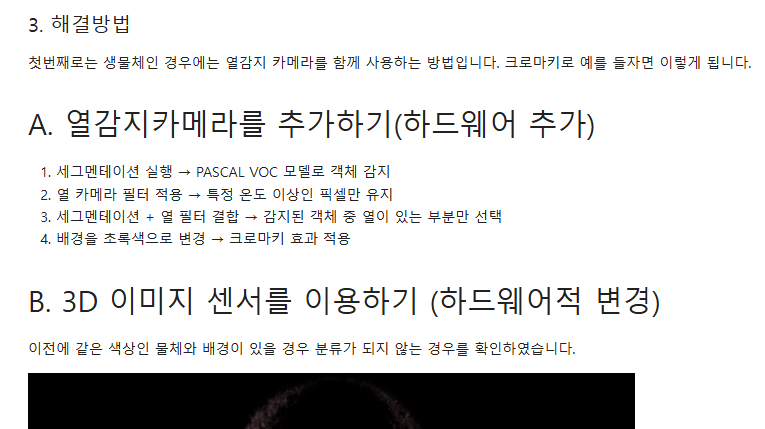
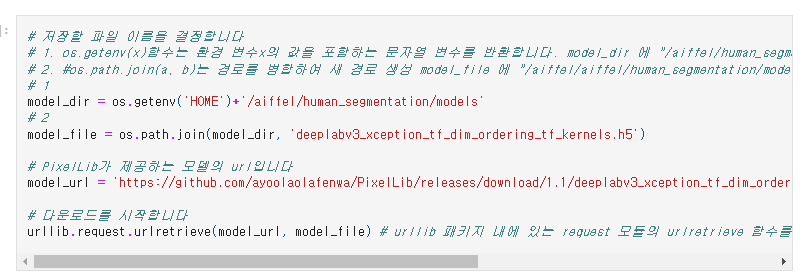

# AIFFEL Campus Online Code Peer Review Templete
- 코더 : 이정우
- 리뷰어 : 조성우


# PRT(Peer Review Template)
- [X]  **1. 주어진 문제를 해결하는 완성된 코드가 제출되었나요?**
    - 문제에서 요구하는 최종 결과물이 첨부되었는지 확인
        - 인물모드, 아웃포커스를 구현한 내용이 제출물에 포함되어 있습니다. 
        
    
- [X]  **2. 전체 코드에서 가장 핵심적이거나 가장 복잡하고 이해하기 어려운 부분에 작성된 
주석 또는 doc string을 보고 해당 코드가 잘 이해되었나요?**
    - 작성한 코드의 흐름을 잘 이해할 수 있도록 수행단위를 나누어 표현한 점이 좋았습니다.
        
        
- [X]  **3. 에러가 난 부분을 디버깅하여 문제를 해결한 기록을 남겼거나
새로운 시도 또는 추가 실험을 수행해봤나요?**
    - 프로젝트를 수행하며 문제가 생겼던 부분을 요약하고 해결 과정을 이해하기 쉽게 설명하였습니다.
        - 
        
- [X]  **4. 회고를 잘 작성했나요?**
    - 프로젝트를 진행하며 문제가 생겼던 부분을 해결하기 위한 해결책을 탐구하고 정리한 내용이 좋았습니다. 
        
        
- [X]  **5. 코드가 간결하고 효율적인가요?**
    - 코드를 처음 읽는 사람도 이해하기 편하도록 자세히 주석을 기록해 놓은 부분이 좋았습니다.
        - 


# 회고(참고 링크 및 코드 개선)
```
전반적으로 수행해야할 부분들을 성실히 수행하였으며 해결책 제시를 위해
하드웨어적인 해결책을 고찰한 부분이 저에겐 새로웠습니다. 항상 모델 내에서
고민하지말고 다양한 해결책을 고민해볼 수 있겠다는 생각이 드는 리포트였습니다!
```
