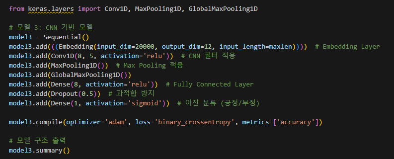
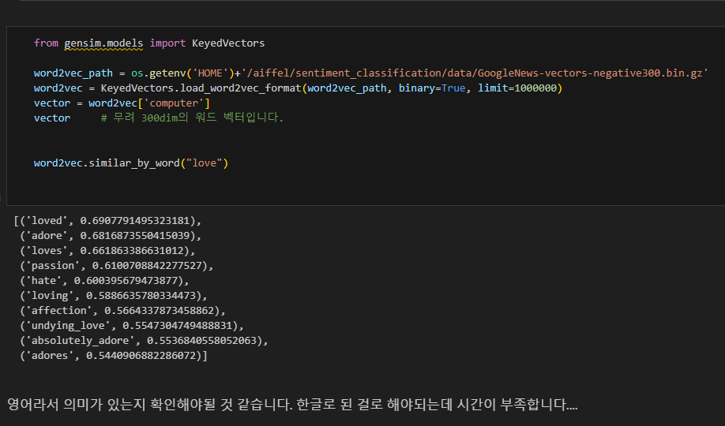
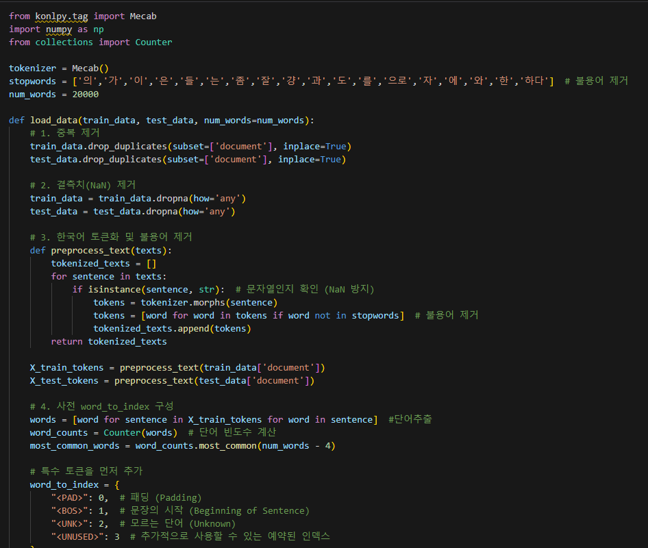

# AIFFEL Campus Online Code Peer Review Templete
- 코더 : 이정우
- 리뷰어 : 조성우


# PRT(Peer Review Template)
- [ ]  **1. 주어진 문제를 해결하는 완성된 코드가 제출되었나요?**
    - 문제에서 요구하는 최종 결과물이 첨부되었는지 확인
        - 중요! 해당 조건을 만족하는 부분을 캡쳐해 근거로 첨부
    
- [X]  **2. 전체 코드에서 가장 핵심적이거나 가장 복잡하고 이해하기 어려운 부분에 작성된 
주석 또는 doc string을 보고 해당 코드가 잘 이해되었나요?**
    - 
    - 모델을 설정하는 부분에서 자세한 주석을 통해 어떤 생각을 하며 모델을 구성하였는지 이해하기 쉬웠습니다.
        
- [X]  **3. 에러가 난 부분을 디버깅하여 문제를 해결한 기록을 남겼거나
새로운 시도 또는 추가 실험을 수행해봤나요?**
    - 프로젝트를 진행하며 영어로 학습된 임베딩 메트릭스를 가져와서 생긴 문제점을 잘 기록하여 두고 이를 해결하기 위해 노력한 내용이 기술되어 있습니다.
        - 
        
        
- [X]  **4. 회고를 잘 작성했나요?**
    - 주어진 문제를 해결하는 완성된 코드 내지 프로젝트 결과물에 대해
    배운점과 아쉬운점, 느낀점 등이 기록되어 있는지 확인
    - 전체 코드 실행 플로우를 그래프로 그려서 이해를 돕고 있는지 확인
        - 시간이 부족하여 완성하지 못한 아쉬움이 기록되어 있습니다.
        
- [X]  **5. 코드가 간결하고 효율적인가요?**
    - 파이썬 스타일 가이드 (PEP8) 를 준수하였는지 확인
    - 코드 중복을 최소화하고 범용적으로 사용할 수 있도록 함수화/모듈화했는지 확인
        - 데이터를 불러오고 전처리해야 하는 부분을 적절한 함수로 모듈화하여 범용적으로 사용할 수 있는 함수를 생성하였습니다.
        -


# 회고(참고 링크 및 코드 개선)
```
이번 프로젝트를 진행하면서 사전 훈련된 임베딩을 잘못 불러오거나 적절한 입력 문장의 길이를 설정하는 부분에서
어려움이 있었지만 끝까지 프로젝트를 완료하기 위해 노력했다는 점이 많이 느껴지는 코드였습니다.
```
