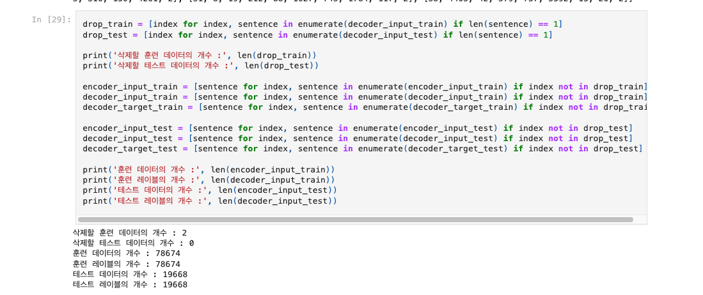
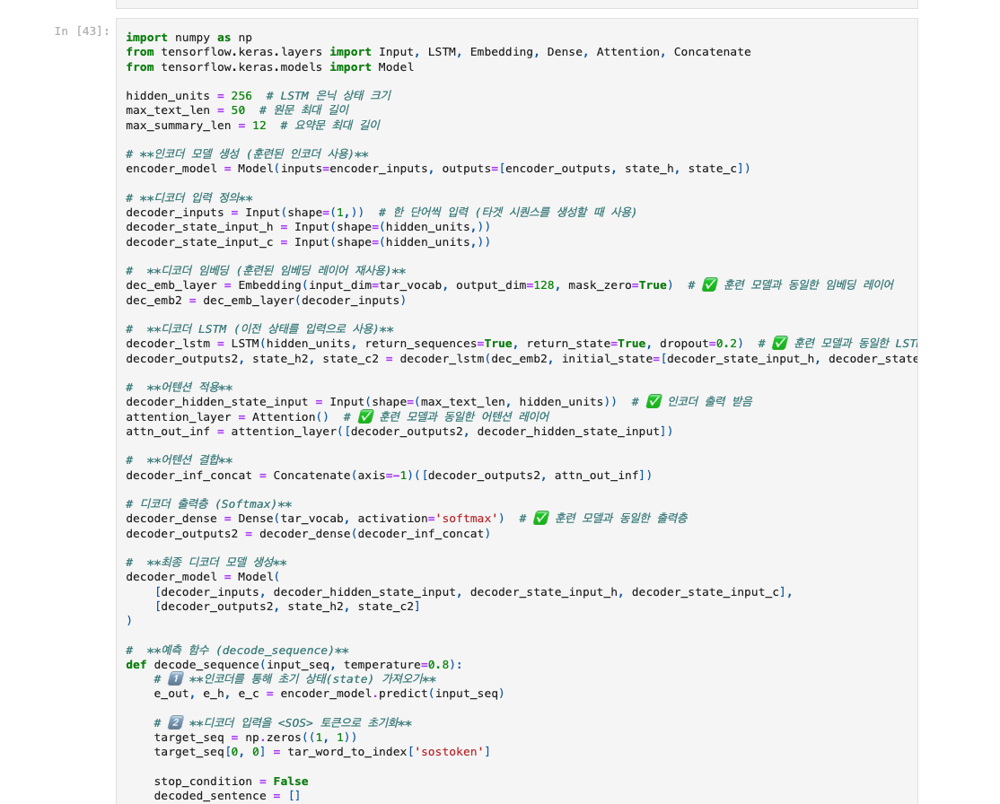
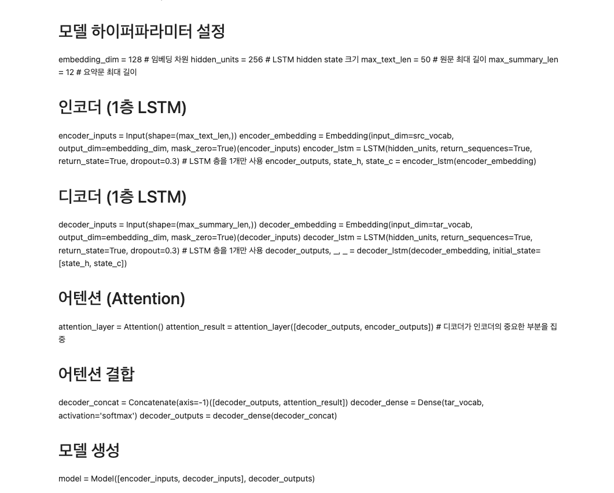
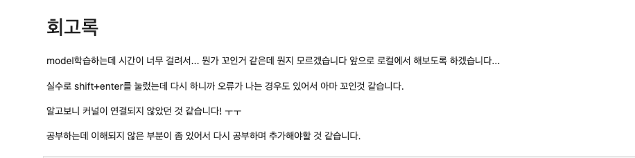

# AIFFEL Campus Online Code Peer Review Templete
- 코더 : 이 정우
- 리뷰어 : 김 영만


# PRT(Peer Review Template)
- [*]  **1. 주어진 문제를 해결하는 완성된 코드가 제출되었나요?**
    - Abstractive 모델 구성을 위한 텍스트 전처리 단계가 체계적으로 진행되었습니다..
        -  
    - 텍스트 요약모델이 성공적으로 학습되었음을 확인하였습니다.
        -   
- [*]  **2. 전체 코드에서 가장 핵심적이거나 가장 복잡하고 이해하기 어려운 부분에 작성된 
주석 또는 doc string을 보고 해당 코드가 잘 이해되었나요?**
    - 모델 정의 된 부분이고 에테션의 Concate가 구현 되어있습니다.
        -   
    - 모델 구현에 대한 문서화가 되어 있습니다.
         -          
- [ ]  **3. 에러가 난 부분을 디버깅하여 문제를 해결한 기록을 남겼거나
새로운 시도 또는 추가 실험을 수행해봤나요?**
    - 문제 원인 및 해결 과정을 잘 기록하였는지 확인
    - 프로젝트 평가 기준에 더해 추가적으로 수행한 나만의 시도, 
    실험이 기록되어 있는지 확인
        - 중요! 잘 작성되었다고 생각되는 부분을 캡쳐해 근거로 첨부
        
- [*]  **4. 회고를 잘 작성했나요?**
    - 솔직한 회고가 작성 되어 있습니다.
         -      
        
- [ ]  **5. 코드가 간결하고 효율적인가요?**
    - 파이썬 스타일 가이드 (PEP8) 를 준수하였는지 확인
    - 코드 중복을 최소화하고 범용적으로 사용할 수 있도록 함수화/모듈화했는지 확인
        - 중요! 잘 작성되었다고 생각되는 부분을 캡쳐해 근거로 첨부


# 회고(참고 링크 및 코드 개선)
```
노드 학습과 프로젝트 진행 시에 참석 하지 못하고, 환경이 좋지 않은데도,
완료를 하기 위해 노력 한 부분이 좋았습니다.
```
