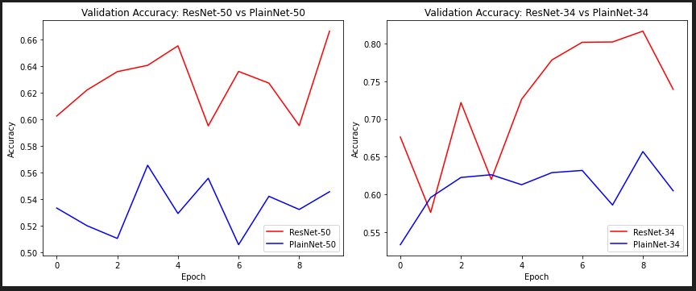
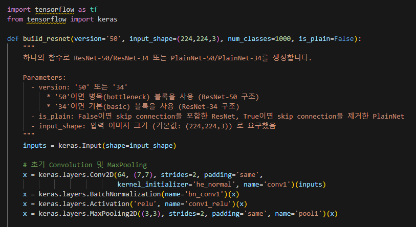
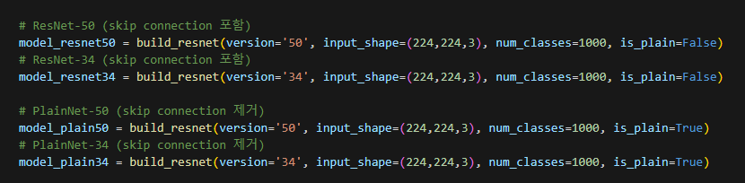

# AIFFEL Campus Online Code Peer Review Templete
- 코더 : 이정우
- 리뷰어 : 조성우


# PRT(Peer Review Template)
- [X]  **1. 주어진 문제를 해결하는 완성된 코드가 제출되었나요?**
    - 
    - 최종 목표인 비교 실험 후 차이를 관찰할 수 있는 그래프를 확인할 수 있습니다.
    
- [X]  **2. 전체 코드에서 가장 핵심적이거나 가장 복잡하고 이해하기 어려운 부분에 작성된 
주석 또는 doc string을 보고 해당 코드가 잘 이해되었나요?**
- 
    - 이번 프로젝트에서 가장 복잡한 모델 구현 부분에서 직접 설명을 작성한 부분이 이해하는데에 도움이 되었습니다.

        
- [X]  **3. 에러가 난 부분을 디버깅하여 문제를 해결한 기록을 남겼거나
새로운 시도 또는 추가 실험을 수행해봤나요?**
    - 회고 부분에 이번 프로젝트를 하면서 Out-of-Memory 혹은 학습을 위해 장시간 클라우드를 사용하다보면 커널이 초기화되곤 하는 문제가 발생하였을텐데, 그 부분이 잘 기록되어 있습니다.
        
- [X]  **4. 회고를 잘 작성했나요?**
    - 
    - 이번 프로젝트를 하면서 생겼던 문제를 정리하고 부족한 부분을 기록하여 추후에 공부해야할 점들이 잘 정리되어 있습니다.
        
- [X]  **5. 코드가 간결하고 효율적인가요?**
    - 
    - 모델 설계를 함에 있어, 하나의 함수로 모두 구현하여 재사용성을 높인 부분이 좋았습니다.
    - 이 부분이 하나의 함수로 정리되어 있어서 실행되는 코드의 수를 크게 줄일 수 있었다고 생각합니다.


# 회고(참고 링크 및 코드 개선)
```
코드를 살펴보면서 저와 유사한 부분들이 많다고 생각이 들었습니다. 비슷한 고민을 다들 하는구나를 느낄 수 있었고 저와 차이가 나는 부분들을 통해 제 코드의 문제점을 파악할 수 있겠다는 생각을 하였습니다.
Accuracy그래프가 제가 작성한 코드에서 확인한 모습보다 조금 더 변동성이 심해 보이는데 아마 모델 생성할 때 num_classes를 논문 내용에서와 같이 1000개로 설정해서 그런 것 같습니다.
현재 분류하고자 하는 class의 개수를 반영하면 좋아지지 않을까? 라는 생각이 들었습니다.
```
