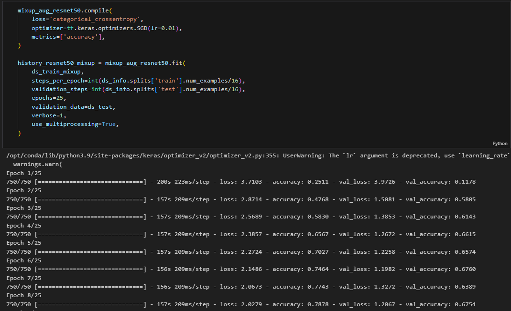
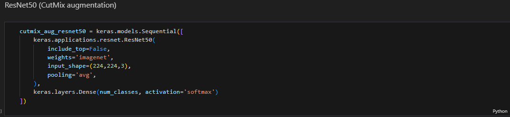
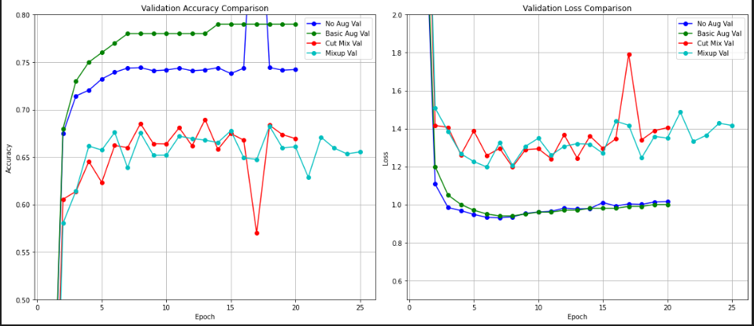
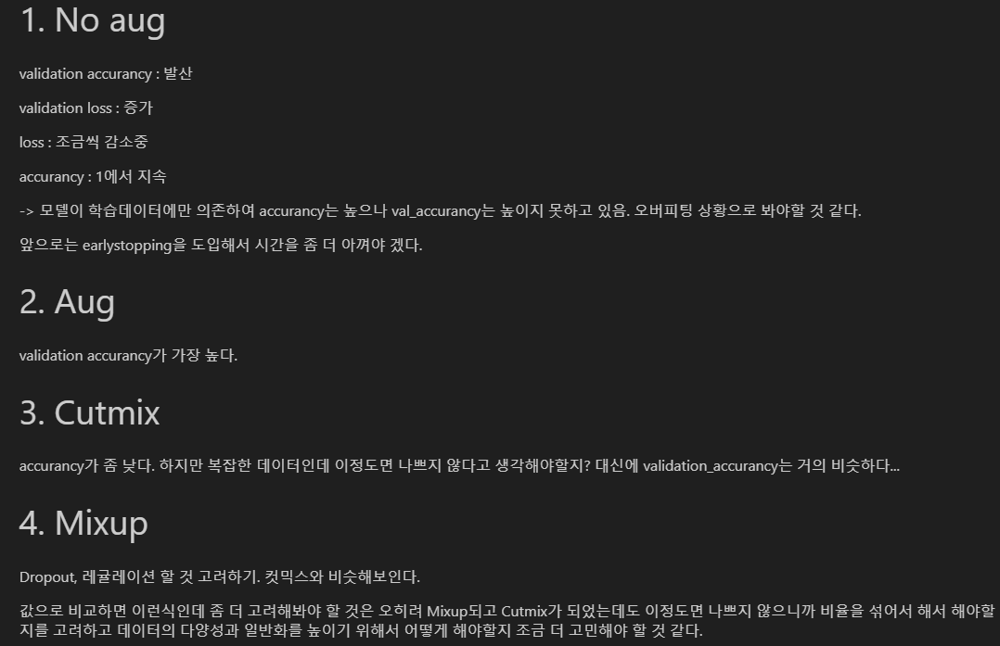
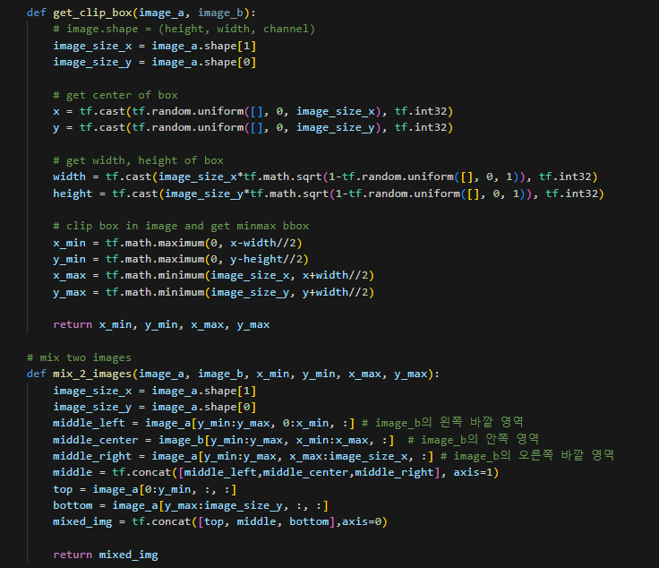
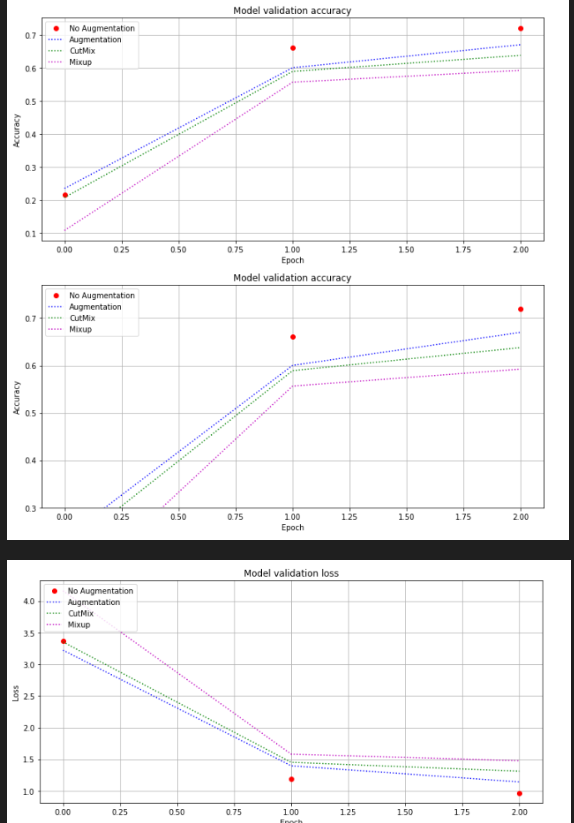
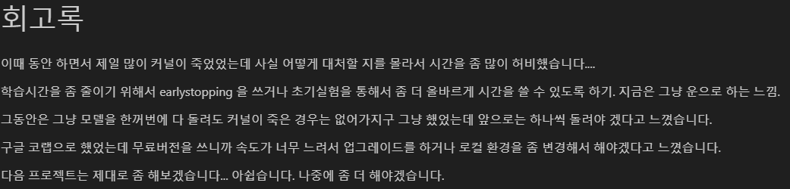
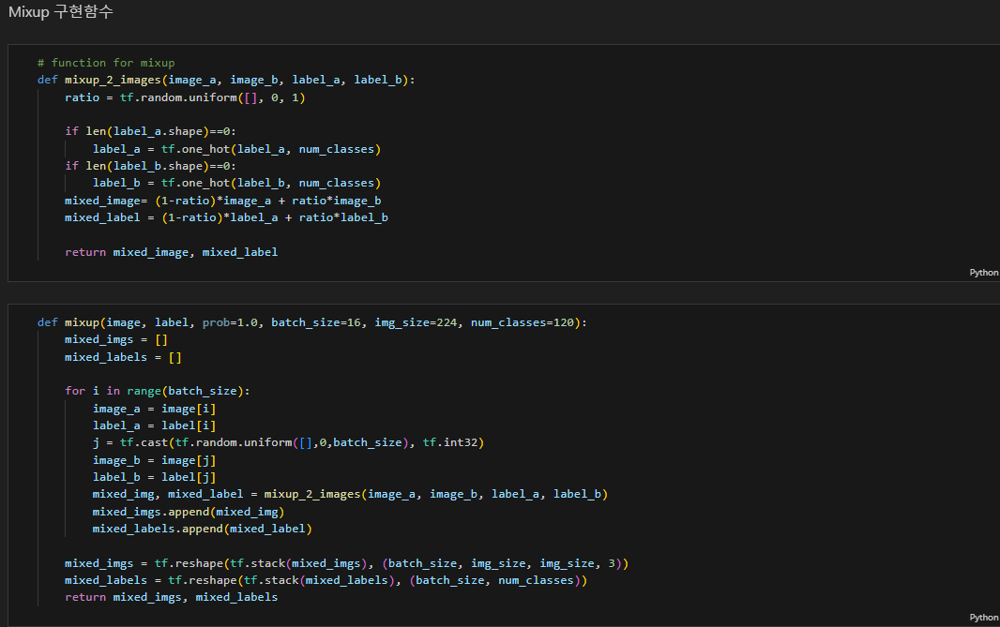

# AIFFEL Campus Online Code Peer Review Templete
- 코더 : 이정우
- 리뷰어 : 김인수


# PRT(Peer Review Template)
- [X]  **1. 주어진 문제를 해결하는 완성된 코드가 제출되었나요?**
    - 문제에서 요구하는 최종 결과물이 첨부되었는지 확인  
       
        - [X] Cutmix, Mixup 모델이 수렴하였습니다.  
          
          
          

        - [X] 기본 augmentation을 적용했을 때 accuracy가 가장 높음을 실험으로 알아냈습니다.  

        - [X] 실험 결과를 시각화하고 비교분석하였습니다.  
          
    
- [X]  **2. 전체 코드에서 가장 핵심적이거나 가장 복잡하고 이해하기 어려운 부분에 작성된 
주석 또는 doc string을 보고 해당 코드가 잘 이해되었나요?**
    augmentation을 위한 메인 코드의 주요 주석이 잘 작성되어 있습니다.  
      

        
- [X]  **3. 에러가 난 부분을 디버깅하여 문제를 해결한 기록을 남겼거나
새로운 시도 또는 추가 실험을 수행해봤나요?**  

    3에폭의 초기 실험을 수행한 후, 모델이 수렴하는 것을 확인하기 위하여 추가로 최대대 25에폭까지 실험하였습니다.  
      


- [X]  **4. 회고를 잘 작성했나요?**
    회고를 잘 작성하셨습니다.
      
        
- [X]  **5. 코드가 간결하고 효율적인가요?**
    코드는 간결하게 잘 작성하셨습니다.
      


# 회고(참고 링크 및 코드 개선)
```
주어진 과제를 성실하게 수행하셨습니다.
```
