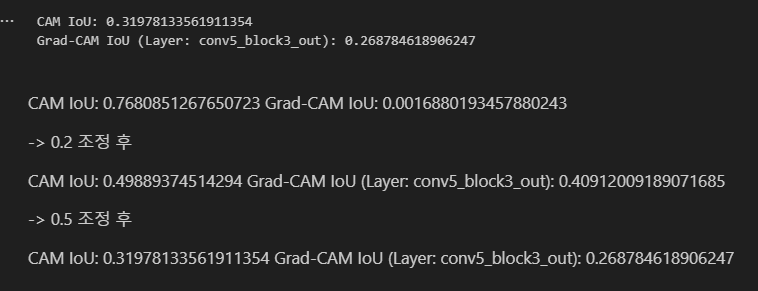
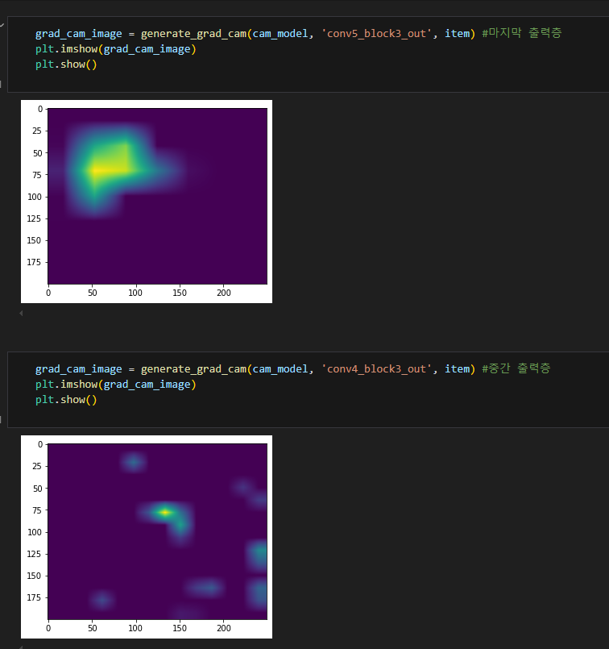
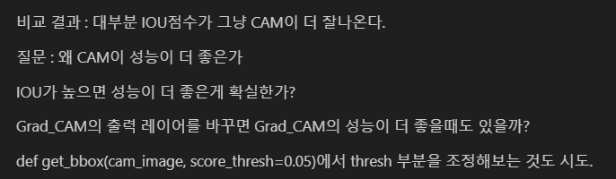
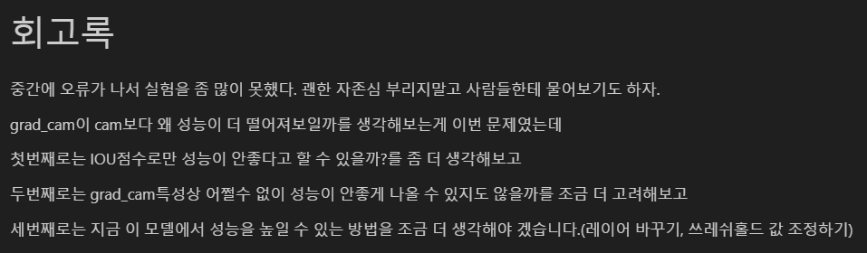
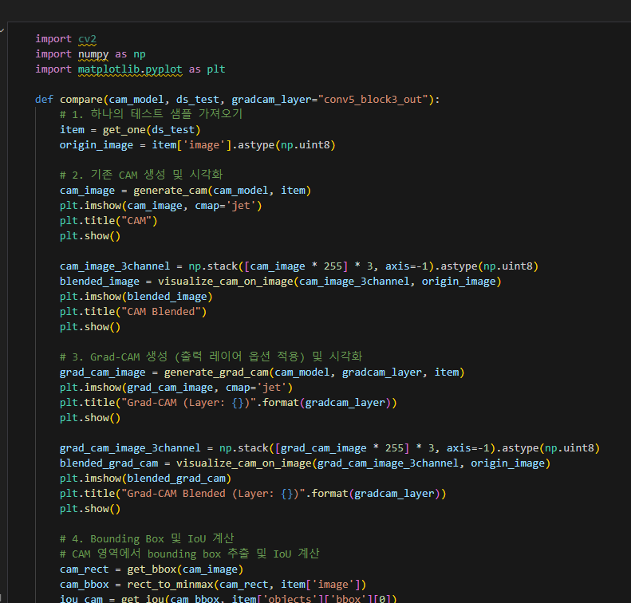

# AIFFEL Campus Online Code Peer Review Templete
- 코더 : 이정우
- 리뷰어 : 조성우


# PRT(Peer Review Template)
- [X]  **1. 주어진 문제를 해결하는 완성된 코드가 제출되었나요?**
    - 
    - CAM과 Grad-CAM의 IOU를 비교하여 어떤 방식이 특정 상황에 더 나은지 비교하고 있습니다.
    
- [X]  **2. 전체 코드에서 가장 핵심적이거나 가장 복잡하고 이해하기 어려운 부분에 작성된 
주석 또는 doc string을 보고 해당 코드가 잘 이해되었나요?**
- 
- Grad-CAM을 적용하여 활성화맵을 확인할 때, 레이어의 수준별로 주석을 달아주셔서 이해하기 편했습니다.
        
- [X]  **3. 에러가 난 부분을 디버깅하여 문제를 해결한 기록을 남겼거나
새로운 시도 또는 추가 실험을 수행해봤나요?**
- 
- 의문이 들었던 내용을 정리하고 다음 실험으로 이를 확인해보는 과정에서 추가실험을 자연스럽게 시도하였습니다.
        
- [X]  **4. 회고를 잘 작성했나요?**
    - 
    - 실험을 진행하면서 생겼던 의문과 성능을 더 발전시킬 수 있는 방법들을 기록하여 추후에 이를 보완할 수 있도록 회고를 잘 작성하였습니다.
        
- [X]  **5. 코드가 간결하고 효율적인가요?**
    - 
    - 반복적으로 사용되는 CAM과 Grad-CAM의 IOU를 비교하는 과정을 하나의 함수로 만들어 재사용성을 높였습니다.


# 회고(참고 링크 및 코드 개선)
```
프로젝트를 끝까지 완수하려 노력하신 점이 공감이 많이 갑니다.
항상 바쁜 스케줄 속에서 할 수 있는 부분까지 완료하시고 이를 공유해주시려는 노력 덕분에
저도 조금이라도 더 노력할 수 있지 않나라는 생각이 들었습니다. 고생하셨습니다!
```
