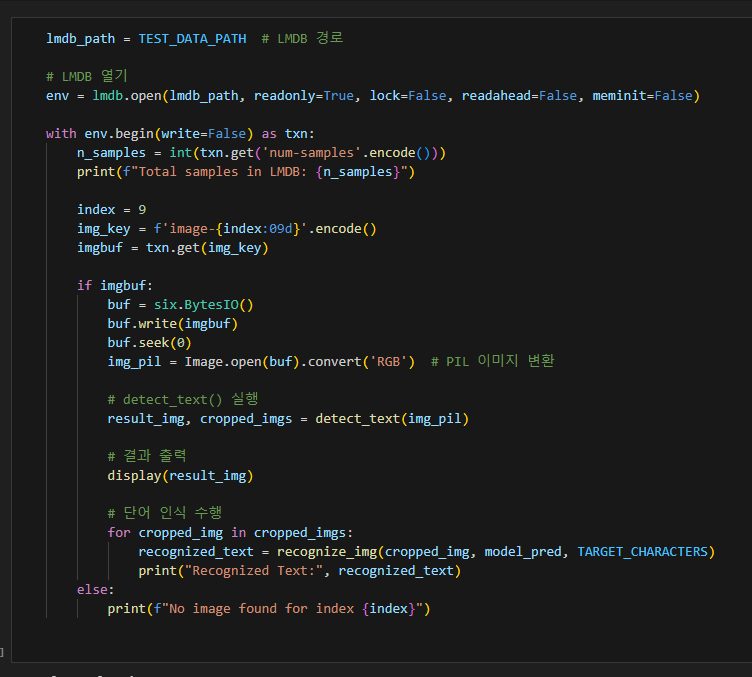
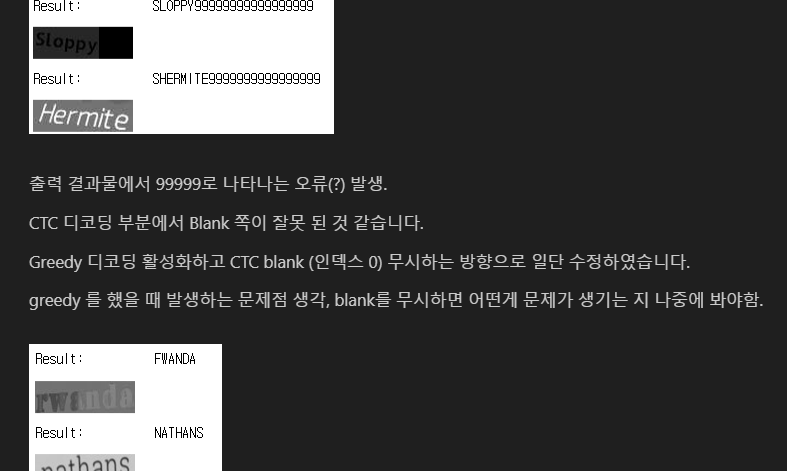
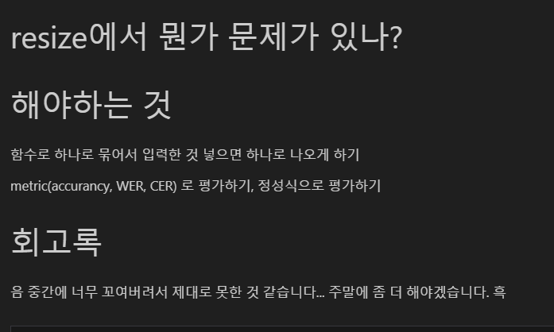
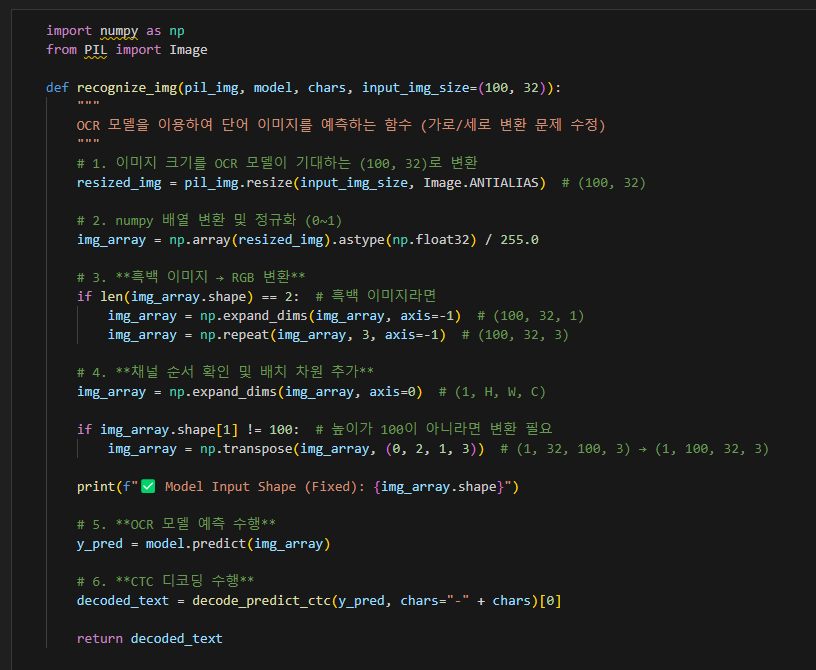
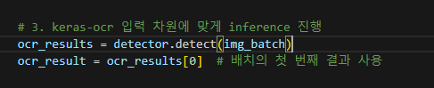

# AIFFEL Campus Online Code Peer Review Templete
- 코더 : 이정우
- 리뷰어 : 조성우


# PRT(Peer Review Template)
- [ ]  **1. 주어진 문제를 해결하는 완성된 코드가 제출되었나요?**
    - 문제에서 요구하는 최종 결과물이 첨부되었는지 확인
        - 중요! 해당 조건을 만족하는 부분을 캡쳐해 근거로 첨부
    
- [X]  **2. 전체 코드에서 가장 핵심적이거나 가장 복잡하고 이해하기 어려운 부분에 작성된 
주석 또는 doc string을 보고 해당 코드가 잘 이해되었나요?**
- 
- 최종 결과물로 나아가야 하는 부분이면서 저와 다르게 직접 lmdb에 접근해서 처리한 부분이 인상적이었습니다.
- 중간 중간 주석 덕분에 바로 이해할 수 있어서 좋았습니다.
        
- [X]  **3. 에러가 난 부분을 디버깅하여 문제를 해결한 기록을 남겼거나
새로운 시도 또는 추가 실험을 수행해봤나요?**
- 
- 해당 부분에서 CTC디코딩에 문제가 있다고 판단한 다음 greedy search로 바꾸고 '-1' 인덱스 출력을 무시하는 방향으로 수정하였습니다.
        
- [X]  **4. 회고를 잘 작성했나요?**
    - 
    - 문제 해결을 위해 노력하셨던 점이 느껴지는 회고록이었습니다.
        
- [X]  **5. 코드가 간결하고 효율적인가요?**
    - 
    - 재사용해야할 코드를 함수로 만들고 내부 로직에 단계별로 주석이 작성되어 있어서 좋았습니다.


# 회고(참고 링크 및 코드 개선)

```
어떤 부분을 해결하면 inference가 잘 될까 유심히 살펴보았습니다. CTC 디코딩 부분에
greedy search로 바꾼 점은 에러를 일으킬 정도인가는 잘 모르겠습니다. detection하는 함수에서
배치 차원을 사용하셨기 때문에 img_batch[0]로 detect하면 뒤에 recognize할 때 이미지로 넘길
수 있어서 문제가 해결되지 않을까요..? 직접 돌려볼 시간이 없어서 회고로 남기겠습니다.
```
