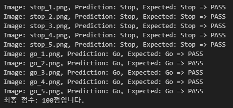
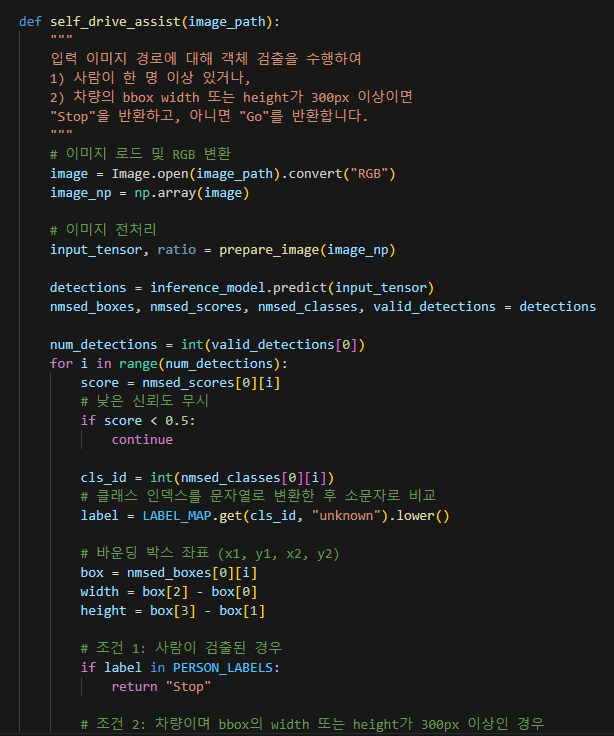
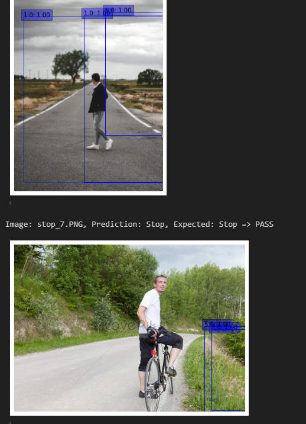
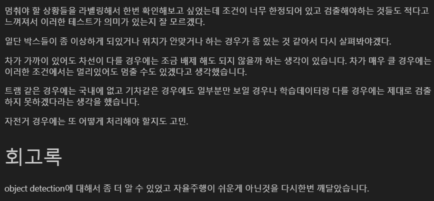
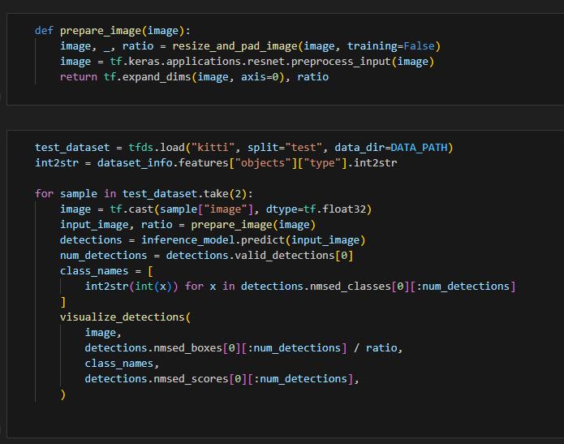

# AIFFEL Campus Online Code Peer Review Templete
- 코더 : 이정우
- 리뷰어 : 조성우


# PRT(Peer Review Template)
- [X]  **1. 주어진 문제를 해결하는 완성된 코드가 제출되었나요?**
    - 
    - 10장의 go, stop 사진을 잘 판단하는 것을 확인할 수 있었습니다.
    
- [X]  **2. 전체 코드에서 가장 핵심적이거나 가장 복잡하고 이해하기 어려운 부분에 작성된 
주석 또는 doc string을 보고 해당 코드가 잘 이해되었나요?**
- 
- 프로젝트에서 요구했던 자율 주행 보조 시스템 함수를 작성하였습니다.
- 규칙이 적용되는 순서대로 주석을 잘 작성하여 이해하기 편했습니다.
        
- [X]  **3. 에러가 난 부분을 디버깅하여 문제를 해결한 기록을 남겼거나
새로운 시도 또는 추가 실험을 수행해봤나요?**
- 
- 직접 새로운 사진들을 활용하여 예측 성능을 확인해보는 추가 실험을 진행했습니다.
- 추가 실험을 진행하면서 생겼던 문제점을 회고에 잘 정리하고 있습니다.
        
- [X]  **4. 회고를 잘 작성했나요?**
    - 
    - 추가 실험을 하면서 생겼던 의문들을 정리하여 실험 중에 어떤 고민을 하였는지 이해할 수 있었습니다.
        
- [X]  **5. 코드가 간결하고 효율적인가요?**
    - 
    - 함수를 정의하는 부분과 실행하는 부분을 나누어 전반적인 흐름을 파악하기 좋았습니다.


# 회고(참고 링크 및 코드 개선)
```
하나의 실험을 잘 마무리하셨다고 생각이 들며, 저도 시간 내에 잘 마무리 할 수 있도록
더욱 노력해야겠다는 생각이 들었습니다. 고생하셨습니다!
```
