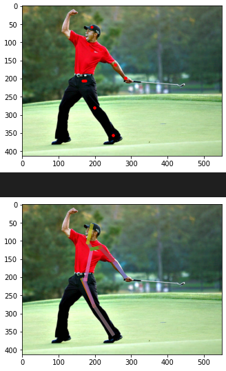
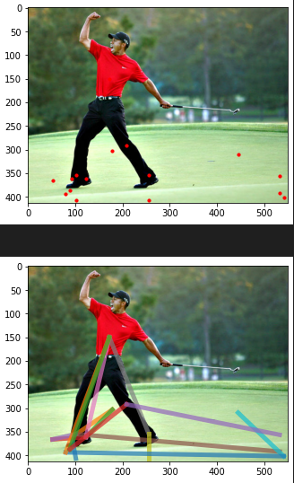
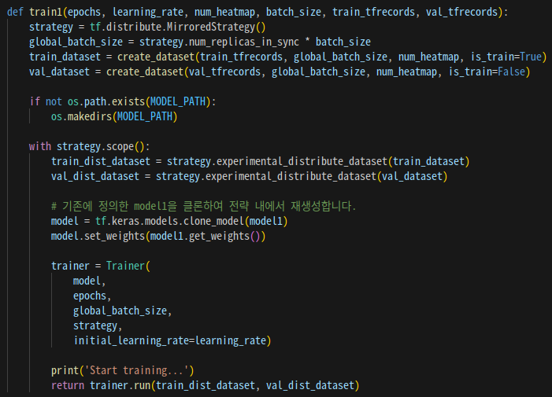
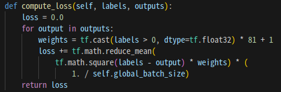
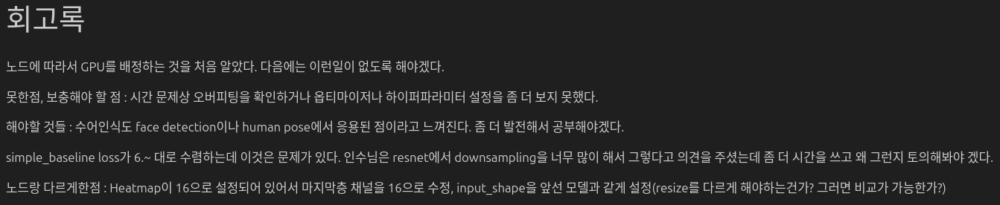
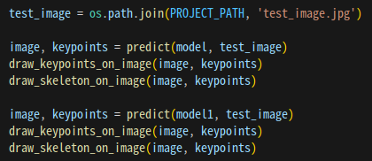

# AIFFEL Campus Online Code Peer Review Templete
- 코더 : 이정우
- 리뷰어 : 홍예린


# PRT(Peer Review Template)
- [X]  **1. 주어진 문제를 해결하는 완성된 코드가 제출되었나요?**  
       
    - 학습 후 key points 예측을 하여 이미지에 표시함
    
- [X]  **2. 전체 코드에서 가장 핵심적이거나 가장 복잡하고 이해하기 어려운 부분에 작성된 
주석 또는 doc string을 보고 해당 코드가 잘 이해되었나요?**  
      
    - `model = tf.keras.models.clone_model(model1)` 모델을 복사해서 사용한 부분이 인상적
    - 주석을 달아놓아 이해하기 쉬웠음

- [X]  **3. 에러가 난 부분을 디버깅하여 문제를 해결한 기록을 남겼거나
새로운 시도 또는 추가 실험을 수행해봤나요?**  
      
    - 로스를 계산할 때 type 에러가 나서 수정한 부분을 구두로 설명
        
- [X]  **4. 회고를 잘 작성했나요?**  
      
    - 실험을 진행하면서 있었던 시행착외들을 알 수가 있음
        
- [X]  **5. 코드가 간결하고 효율적인가요?**  
      
    - 전체적으로 코드가 간결하고 이해하기 쉬움
    - 함수화를 통해 마지막 구현이 간단했음


# 회고(참고 링크 및 코드 개선)
```
- 모델 clone해서 사용한 부분이 인상적
- 관심있는 분야에 활용 방안에 대하여 고민한 부분도 인상적
- 깔끔하고 보기 좋은 코드!
```
